# Projet Fil Rouge DevOps — IC GROUP

## Description

Mise en place d'une chaine DevOps complete pour le compte de la societe "fictive" **IC GROUP**, qui souhaite exposer un site web vitrine permettant d'acceder a deux applications internes :

- **Odoo** : ERP (ventes, comptabilite, RH, inventaire...)
- **pgAdmin** : outil d'administration graphique de la base de donnees PostgreSQL d'Odoo

Le projet est decoupe en trois parties, conformement a l'enonce du Bootcamp DevOps Eazytraining : 

- **Partie 1** : conteneurisation du site vitrine avec Docker
- **Partie 2** : mise en place d'un pipeline CI/CD (Jenkins + Ansible) sur une infrastructure AWS
- **Partie 3** : deploiement de l'ensemble des applications sur un cluster Kubernetes (Minikube)

> Ce projet a ete realise en ecrivant manuellement le Dockerfile, le Jenkinsfile, les roles Ansible et les manifests Kubernetes, afin de mieux assimiler les mecanismes internes de chaque outil.

---

## Environnement

| Composant | Version |
|-----------|---------|
| OS (poste de pilotage) | Ubuntu 25.04 (VM VMware) |
| Docker | 29.x |
| Ansible | core 2.16.x |
| Jenkins | LTS (image `jenkins/jenkins:lts`) |
| Minikube | v1.38.1 |
| Kubernetes | v1.35.1 |
| kubectl | v1.36.1 |
| Cloud | AWS EC2 (region eu-west-3 — Paris) |

---

## Architecture globale

```
                         +-----------------------+
                         |   GitHub (repo perso)  |
                         +------------+-----------+
                                      | webhook push
                                      v
        +---------------------------------------------------+
        |          Serveur Jenkins (AWS EC2)                 |
        |               t2.medium - 50 Go                     |
        |            IP Elastic : 52.47.143.52                |
        |                                                     |
        |  +-----------------------------------------------+  |
        |  | Container Docker "jenkins" (port 8080)        |  |
        |  |  - Jenkinsfile (build/test/push/deploy)        |  |
        |  |  - Ansible installe sur l'hote                  |  |
        |  +-----------------------------------------------+  |
        +-----------------------+--------------+--------------+
                                | SSH/Ansible  | SSH/Ansible
                     +----------v---+      +---v-----------+
                     |  Serveur app  |      |  Serveur Odoo |
                     | + pgAdmin     |      |               |
                     |  t2.micro     |      |   t2.micro    |
                     | 15.224.68.210 |      | 35.181.186.248|
                     |               |      |               |
                     | - ic-webapp   |      | - Odoo 13.0   |
                     | - pgAdmin4    |<-----+ - PostgreSQL13|
                     |   (port 5050) |      |   (port 5432) |
                     +---------------+      +---------------+
```

### Infrastructure AWS

| Serveur | Role | Type | Stockage | IP Elastic |
|---|---|---|---|---|
| `serveur1-jenkins` | Jenkins + Ansible | t2.medium | 50 Go | `52.47.143.52` |
| `serveur2-app-pgadmin` | Site vitrine + pgAdmin | t2.micro | 20 Go | `15.224.68.210` |
| `serveur3-odoo` | Odoo + PostgreSQL | t2.micro | 20 Go | `35.181.186.248` |

OS : Ubuntu Server 24.04 LTS sur les trois instances.

### Security Groups

| Security Group | Instance | Ports ouverts |
|---|---|---|
| `launch-wizard-1` | serveur1-jenkins | 22 (SSH), 80 (HTTP), 8080 (Jenkins) |
| `launch-wizard-2` | serveur2-app-pgadmin | 22 (SSH), 80 (HTTP), 5050 (pgAdmin) |
| `launch-wizard-3` | serveur3-odoo | 22 (SSH), 80 (HTTP), 8069 (Odoo), 5432 (PostgreSQL) |

Le port 5432 a ete ouvert sur le Security Group d'Odoo pour permettre a pgAdmin (Serveur 2) de se connecter a distance a la base PostgreSQL d'Odoo (Serveur 3).

### Authentification SSH

```bash
ssh -i projet-fil-rouge-key.pem ubuntu@52.47.143.52
```

- Cle privee : `projet-fil-rouge-key.pem` (RSA, format `.pem`)
- Presente sur le poste de pilotage et sur le serveur Jenkins (`~/projet-fil-rouge-key.pem`), car c'est depuis Jenkins qu'Ansible se connecte aux serveurs 2 et 3
- Permissions securisees : `chmod 400` sur la cle, sur les deux machines
- Utilisateur de connexion sur toutes les instances : `ubuntu`

---

## Partie 1 : Conteneurisation du site vitrine

### Contexte applicatif

Le site vitrine est une application web **Python/Flask**, fournie par l'equipe de developpement (repo `eazytraining/projet-fils-rouge`). Elle affiche deux logos cliquables (Odoo, pgAdmin) dont les URLs de destination sont injectees via des variables d'environnement.

**`app.py`** (fourni, non modifie) :
```python
ODOO_URL = os.environ.get('ODOO_URL')
PGADMIN_URL = os.environ.get('PGADMIN_URL')
...
return render_template('index.html', odoo_url=ODOO_URL, pgadmin_url=PGADMIN_URL)
...
app.run(host="0.0.0.0", port=8080)
```

### Etape 1 — Cloner le repository du sujet

```bash
git clone https://github.com/eazytraining/projet-fils-rouge.git
cd projet-fils-rouge
```

### Etape 2 — Creer le fichier de configuration releases.txt

Fichier centralisant les informations de version et de configuration (URLs, version), lu dynamiquement par le Dockerfile au demarrage du container.

```
ODOO_URL: https://odoo.com
PGADMIN_URL: https://pgadmin.org
version: 1.1
```

### Etape 3 — Creer le script de demarrage entrypoint.sh

```bash
nano entrypoint.sh
```

```bash
#!/bin/sh
# Script de demarrage du container
# Lit releases.txt et exporte les valeurs comme variables d'environnement
# avant de lancer l'application Flask

export ODOO_URL=$(awk '/ODOO_URL/ {sub(/^.* /, ""); print}' releases.txt)
export PGADMIN_URL=$(awk '/PGADMIN_URL/ {sub(/^.* /, ""); print}' releases.txt)

exec python app.py
```

```bash
chmod +x entrypoint.sh
```

### Etape 4 — Ecrire le Dockerfile

```bash
nano Dockerfile
```

```dockerfile
# Image de base (demandee dans les consignes)
FROM python:3.6-alpine

# Repertoire de travail dans le container
WORKDIR /opt

# Copie du code de l'application
COPY . /opt

# Installation de Flask (framework python), necessaire a app.py
RUN pip install flask

# Rend le script de demarrage executable
RUN chmod +x entrypoint.sh

# Port utilise par l'application (defini dans app.py)
EXPOSE 8080

# Lancement : le script entrypoint.sh lit releases.txt
# et exporte ODOO_URL / PGADMIN_URL avant de demarrer app.py
ENTRYPOINT ["./entrypoint.sh"]
```

### Etape 5 — Construire l'image et la tester

```bash
docker build -t ic-webapp:1.0 .
```

```bash
docker run -d --name test-ic-webapp -p 8090:8080 ic-webapp:1.0
```

Verification dans le navigateur a l'adresse http://localhost:8090, puis cliquer sur les deux logos pour confirmer la redirection vers les sites officiels Odoo et pgAdmin.

### Site vitrine affiche dans le navigateur
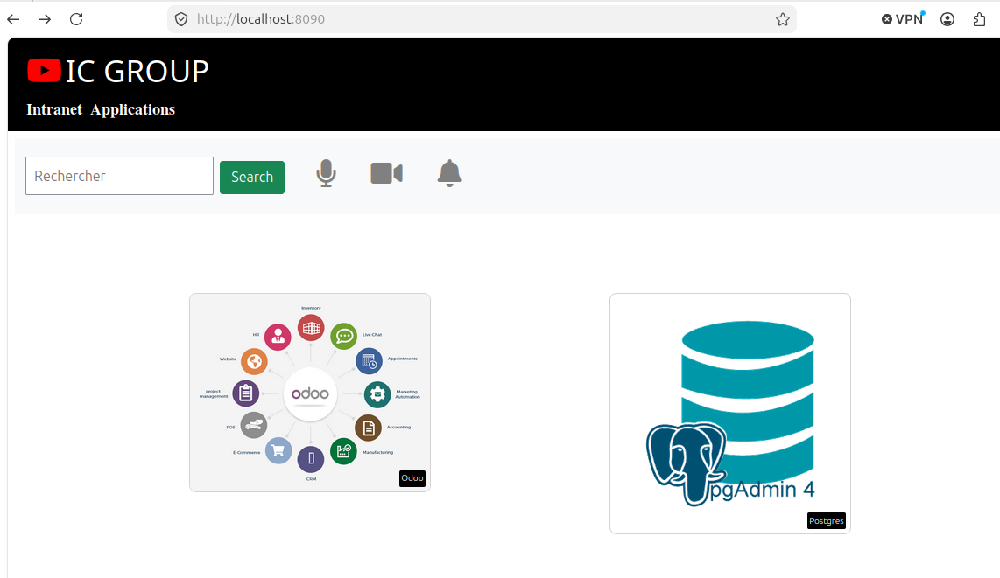

### Redirection vers le site officiel Odoo


### Redirection vers le site officiel pgAdmin
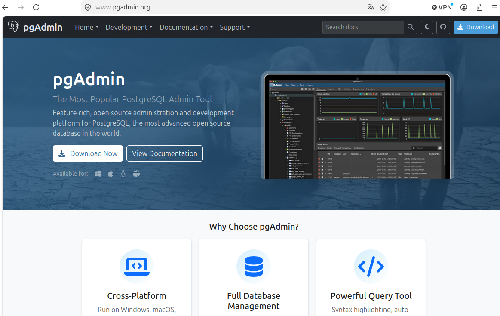

Nettoyage du container de test :
```bash
docker stop test-ic-webapp
docker rm test-ic-webapp
```

### Etape 6 — Publier l'image sur Docker Hub

```bash
docker login
docker tag ic-webapp:1.0 marvindocker28/ic-webapp:1.0
docker push marvindocker28/ic-webapp:1.0
```

### Build de l'image Docker
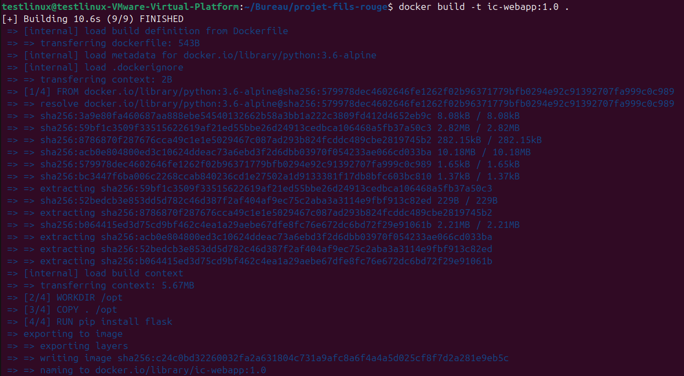

### Image presente localement
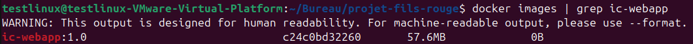

### Image publiee sur Docker Hub
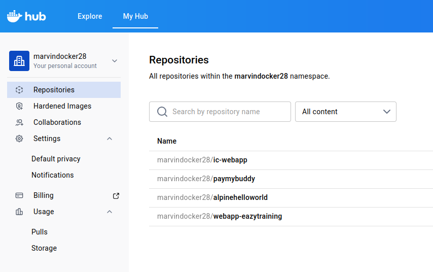

Image Docker Hub : marvindocker28/ic-webapp

---

## Partie 2 : Pipeline CI/CD avec Jenkins et Ansible

### Etape 1 — Creer les instances EC2

Trois instances Ubuntu 24.04 LTS sont creees sur la console AWS, avec une paire de cles SSH dediee (projet-fil-rouge-key) :

- serveur1-jenkins (t2.medium, 50 Go)
- serveur2-app-pgadmin (t2.micro, 20 Go)
- serveur3-odoo (t2.micro, 20 Go)

Une Elastic IP est associee a "chaque instance" pour garantir une adresse fixe meme apres un arret/redemarrage.

A noter : Au moment de la créations des 3 instances les IP sont générées aléatoirement, je me contente de les fixer avec l'Elastic IP ensuite.

### Liste des instances EC2
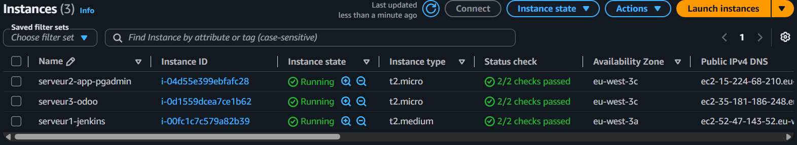

### Etape 2 — Installer Docker sur les trois serveurs

Procedure identique repetee sur chaque serveur :

```bash
sudo apt update
sudo apt install -y ca-certificates curl gnupg

sudo install -m 0755 -d /etc/apt/keyrings
curl -fsSL https://download.docker.com/linux/ubuntu/gpg | sudo gpg --dearmor -o /etc/apt/keyrings/docker.gpg
sudo chmod a+r /etc/apt/keyrings/docker.gpg

echo \
  "deb [arch=$(dpkg --print-architecture) signed-by=/etc/apt/keyrings/docker.gpg] https://download.docker.com/linux/ubuntu \
  $(. /etc/os-release && echo "$VERSION_CODENAME") stable" | \
  sudo tee /etc/apt/sources.list.d/docker.list > /dev/null

sudo apt update
sudo apt install -y docker-ce docker-ce-cli containerd.io docker-buildx-plugin docker-compose-plugin

sudo usermod -aG docker ubuntu
```

Verification :
```bash
docker --version
docker ps
```

### Etape 3 — Installer Jenkins sur le Serveur 1 (via Docker)

```bash
docker volume create jenkins_home

docker run -d \
  --name jenkins \
  -p 8080:8080 \
  -p 50000:50000 \
  -v jenkins_home:/var/jenkins_home \
  -v /var/run/docker.sock:/var/run/docker.sock \
  jenkins/jenkins:lts
```

Le montage de /var/run/docker.sock permet a Jenkins (qui tourne lui-meme dans un container) de piloter le moteur Docker de la machine hote, c'est indispensable pour que le pipeline puisse executer des commandes docker build et docker push.

Recuperation du mot de passe initial :
```bash
docker logs jenkins
```

### Mot de passe initial de Jenkins
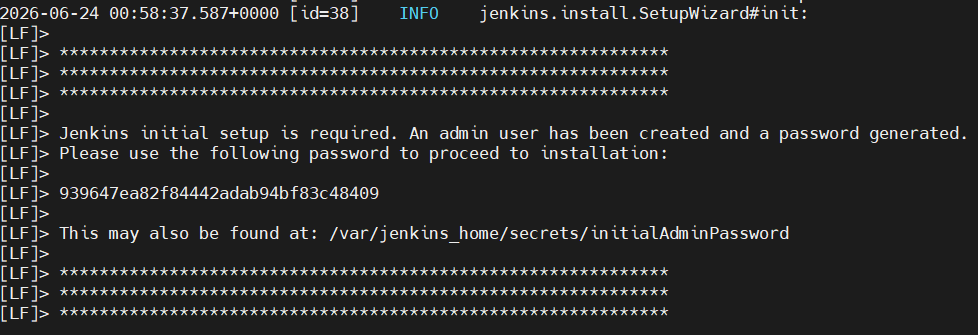

Configuration complementaire necessaire a l'interieur du container (voir section Difficultes rencontrees) :

```bash
docker exec -u root -it jenkins bash

apt-get update
apt-get install -y docker.io

groupmod -g 988 docker
usermod -aG docker jenkins
exit

docker restart jenkins
```

Interface accessible sur http://52.47.143.52:8080.

### Dashboard Jenkins
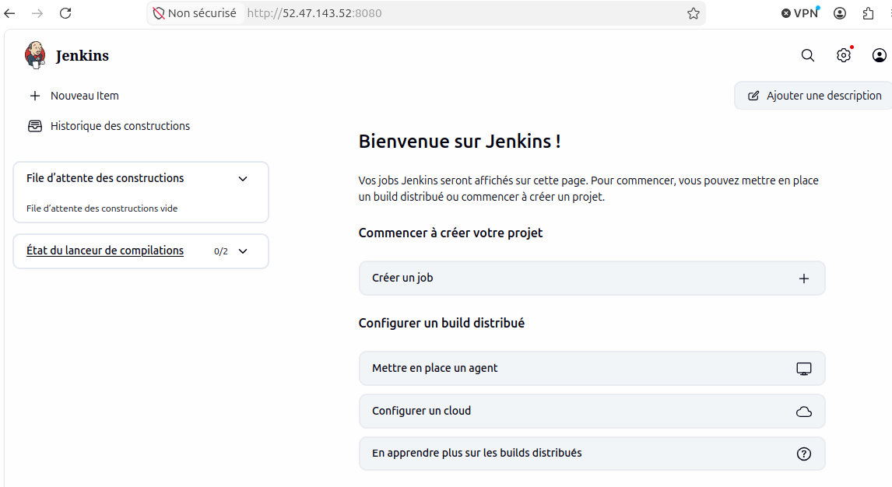

### Etape 4 — Installer Ansible sur le Serveur 1

```bash
sudo apt install -y ansible
ansible --version
```

Transfert de la cle SSH vers le serveur Jenkins (necessaire car c'est depuis ce serveur qu'Ansible va piloter les serveurs 2 et 3) :
```bash
scp -i projet-fil-rouge-key.pem projet-fil-rouge-key.pem ubuntu@52.47.143.52:~/
```

### Etape 5 — Creer l'inventaire Ansible

```bash
mkdir -p ~/ansible-icgroup
cd ~/ansible-icgroup
nano hosts
```

```ini
# Inventaire Ansible - Projet Fil Rouge IC GROUP
# Liste les serveurs cibles, organises par role

# Serveur hebergeant le site vitrine + pgAdmin
[app_pgadmin]
serveur2 ansible_host=15.224.68.210 ansible_user=ubuntu ansible_ssh_private_key_file=/home/ubuntu/projet-fil-rouge-key.pem

# Serveur hebergeant l'application Odoo
[odoo]
serveur3 ansible_host=35.181.186.248 ansible_user=ubuntu ansible_ssh_private_key_file=/home/ubuntu/projet-fil-rouge-key.pem
```

Test de connectivite :
```bash
ansible all -i hosts -m ping
```

### Test de connectivite Ansible
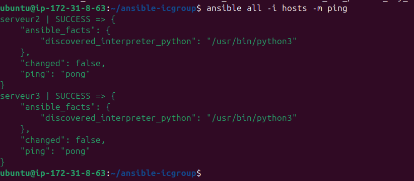

### Etape 6 — Creer les roles Ansible

Structure du projet Ansible (sur le serveur Jenkins, dans ~/ansible-icgroup/) :

```
ansible-icgroup/
├── hosts
├── deploy.yml
└── roles/
    ├── odoo_role/
    │   ├── defaults/main.yml
    │   ├── tasks/main.yml
    │   └── templates/
    │       └── docker-compose.yml.j2
    └── pgadmin_role/
        ├── defaults/main.yml
        ├── files/
        │   └── servers.json
        ├── tasks/main.yml
        └── templates/
            └── docker-compose.yml.j2
```

#### Role odoo_role

roles/odoo_role/defaults/main.yml — variables par defaut, modifiables par l'utilisateur :
```yaml
odoo_network_name: odoo-network
odoo_volume_name: odoo-db-data
odoo_data_path: /data/odoo
odoo_db_container_name: odoo-db
odoo_app_container_name: odoo-app
```

roles/odoo_role/templates/docker-compose.yml.j2 — template Jinja2 variabilise :
```yaml
version: "3.8"

services:

  db:
    image: postgres:13
    container_name: "{{ odoo_db_container_name }}"
    environment:
      POSTGRES_USER: odoo
      POSTGRES_PASSWORD: odoo
      POSTGRES_DB: postgres
    ports:
      - "5432:5432"
    volumes:
      - "{{ odoo_volume_name }}:/var/lib/postgresql/data"
    networks:
      - "{{ odoo_network_name }}"

  odoo:
    image: odoo:13.0
    container_name: "{{ odoo_app_container_name }}"
    depends_on:
      - db
    ports:
      - "8069:8069"
    environment:
      HOST: db
      USER: odoo
      PASSWORD: odoo
    networks:
      - "{{ odoo_network_name }}"

volumes:
  "{{ odoo_volume_name }}":
    driver: local
    driver_opts:
      type: none
      o: bind
      device: "{{ odoo_data_path }}"

networks:
  "{{ odoo_network_name }}": {}
```

roles/odoo_role/tasks/main.yml :
```yaml
- name: Creer le repertoire de donnees Odoo
  ansible.builtin.file:
    path: "{{ odoo_data_path }}"
    state: directory
    mode: "0755"

- name: Deployer le fichier docker-compose pour Odoo
  ansible.builtin.template:
    src: docker-compose.yml.j2
    dest: "/home/{{ ansible_user }}/docker-compose-odoo.yml"
    mode: "0644"

- name: Demarrer les containers Odoo
  community.docker.docker_compose_v2:
    project_src: "/home/{{ ansible_user }}"
    files:
      - docker-compose-odoo.yml
    state: present
```

#### Role pgadmin_role

roles/pgadmin_role/defaults/main.yml :
```yaml
pgadmin_network_name: pgadmin-network
pgadmin_volume_name: pgadmin-data
pgadmin_data_path: /data/pgadmin
pgadmin_container_name: pgadmin
pgadmin_email: admin@icgroup.com
pgadmin_password: admin
```

roles/pgadmin_role/files/servers.json — pre-configure la connexion de pgAdmin vers la base PostgreSQL d'Odoo (hebergee sur un autre serveur, d'ou l'usage d'une adresse IP plutot que d'un nom de service Docker local) :
```json
{
  "Servers": {
    "1": {
      "Name": "Odoo Database",
      "Group": "Servers",
      "Host": "35.181.186.248",
      "Port": 5432,
      "MaintenanceDB": "postgres",
      "Username": "odoo",
      "SSLMode": "prefer"
    }
  }
}
```

roles/pgadmin_role/templates/docker-compose.yml.j2 :
```yaml
version: "3.8"

services:

  pgadmin:
    image: dpage/pgadmin4:latest
    container_name: "{{ pgadmin_container_name }}"
    environment:
      PGADMIN_DEFAULT_EMAIL: "{{ pgadmin_email }}"
      PGADMIN_DEFAULT_PASSWORD: "{{ pgadmin_password }}"
    ports:
      - "5050:80"
    volumes:
      - "{{ pgadmin_volume_name }}:/var/lib/pgadmin"
      - "/home/{{ ansible_user }}/servers.json:/pgadmin4/servers.json:ro"
    networks:
      - "{{ pgadmin_network_name }}"

volumes:
  "{{ pgadmin_volume_name }}":
    driver: local
    driver_opts:
      type: none
      o: bind
      device: "{{ pgadmin_data_path }}"

networks:
  "{{ pgadmin_network_name }}": {}
```

roles/pgadmin_role/tasks/main.yml :
```yaml
- name: Creer le repertoire de donnees pgAdmin
  ansible.builtin.file:
    path: "{{ pgadmin_data_path }}"
    state: directory
    mode: "0755"

- name: Copier le fichier servers.json
  ansible.builtin.copy:
    src: servers.json
    dest: "/home/{{ ansible_user }}/servers.json"
    mode: "0644"

- name: Deployer le fichier docker-compose pour pgAdmin
  ansible.builtin.template:
    src: docker-compose.yml.j2
    dest: "/home/{{ ansible_user }}/docker-compose-pgadmin.yml"
    mode: "0644"

- name: Demarrer le container pgAdmin
  community.docker.docker_compose_v2:
    project_src: "/home/{{ ansible_user }}"
    files:
      - docker-compose-pgadmin.yml
    state: present
```

### Etape 7 — Ecrire le playbook principal

deploy.yml :
```yaml
- name: Deployer Odoo
  hosts: odoo
  become: true
  roles:
    - odoo_role

- name: Deployer pgAdmin
  hosts: app_pgadmin
  become: true
  roles:
    - pgadmin_role
```

```bash
ansible-playbook -i hosts deploy.yml
```

### Resultat du deploiement Ansible
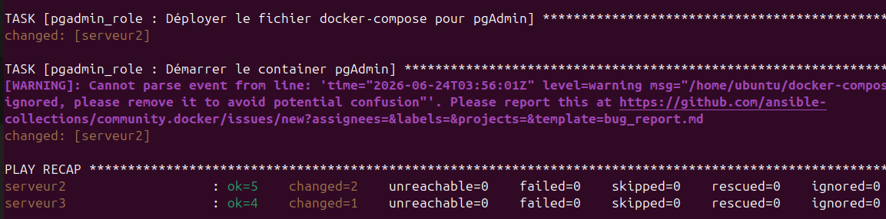

Verification dans le navigateur :
- Odoo : http://35.181.186.248:8069
- pgAdmin : http://15.224.68.210:5050 (identifiants : admin@icgroup.com / admin)

### Odoo accessible et fonctionnel
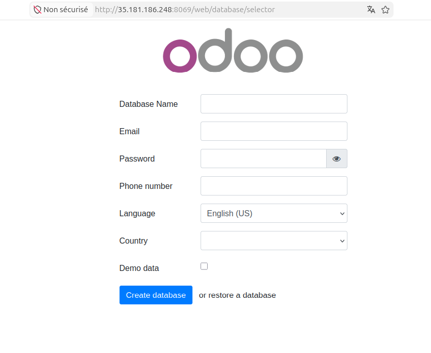

### Page de connexion pgAdmin
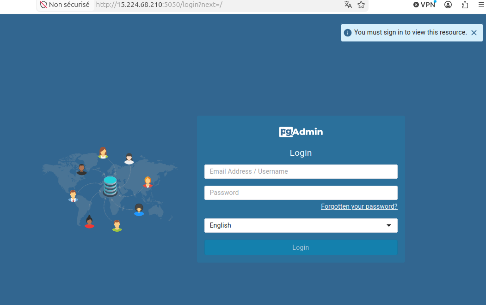

### pgAdmin connecte automatiquement a la base Odoo
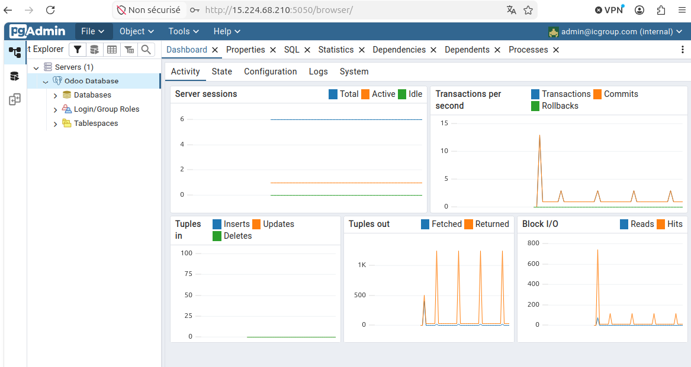

### Etape 8 — Heberger le code sur GitHub (ici,c'est une étape personnelle)

Le code source (Dockerfile, app.py, entrypoint.sh, releases.txt, Jenkinsfile) est pousse sur un repository GitHub personnel :

```bash
git remote set-url origin https://github.com/Marvin-Git-Project/projet-fil-rouge-devops.git
git add .
git commit -m "Conteneurisation ic-webapp avec lecture dynamique de releases.txt"
git push -u origin main
```

L'authentification en HTTPS necessite un Personal Access Token GitHub (fine-grained, scope limite au repo concerne, permission Contents: Read and write), les mots de passe classiques n'etant plus acceptes pour les operations Git en ligne de commande.

### Contenu du repository GitHub
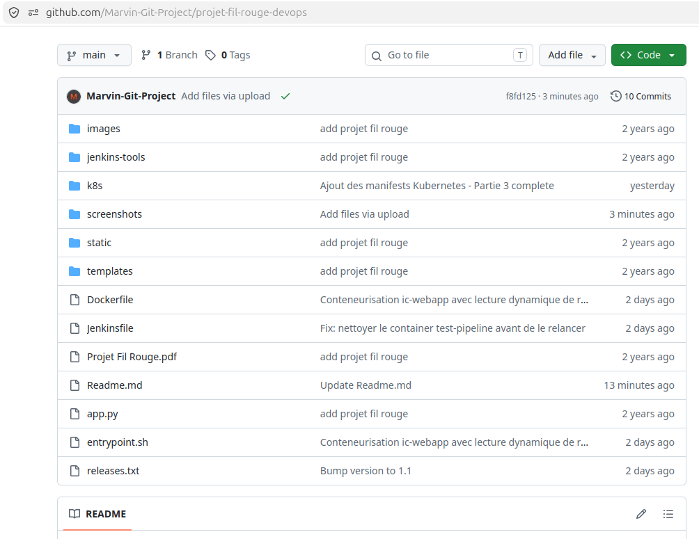

### Etape 9 — Configurer les credentials Jenkins

Dans Manage Jenkins -> Credentials :

| ID | Type | Usage |
|---|---|---|
| dockerhub-creds | Username/Password | Authentification Docker Hub (push d'image) |
| ssh-ansible-key | SSH Username with private key | Connexion SSH pour lancer Ansible |

Plugin supplementaire installe : SSH Agent (fournit la directive sshagent utilisee dans le Jenkinsfile).

### Etape 10 — Ecrire le Jenkinsfile

```groovy
// Pipeline CI/CD - Projet Fil Rouge IC GROUP
// Build, test et deploiement de l'application ic-webapp

pipeline {
    agent any

    environment {
        DOCKERHUB_CREDENTIALS = credentials('dockerhub-creds')
        IMAGE_NAME = "marvindocker28/ic-webapp"
    }

    stages {

        stage('Checkout') {
            steps {
                checkout scm
            }
        }

        stage('Lire la version') {
            steps {
                script {
                    env.APP_VERSION = sh(
                        script: "awk '/version/ {print \$2}' releases.txt",
                        returnStdout: true
                    ).trim()
                    echo "Version detectee : ${env.APP_VERSION}"
                }
            }
        }

        stage('Build') {
            steps {
                sh "docker build -t ${IMAGE_NAME}:${env.APP_VERSION} ."
            }
        }

        stage('Test') {
            steps {
                sh """
                    docker rm -f test-pipeline || true
                    docker run -d --name test-pipeline ${IMAGE_NAME}:${env.APP_VERSION}
                    sleep 5
                    CONTAINER_IP=\$(docker inspect -f '{{range .NetworkSettings.Networks}}{{.IPAddress}}{{end}}' test-pipeline)
                    curl -f http://\$CONTAINER_IP:8080 || exit 1
                    docker stop test-pipeline
                    docker rm test-pipeline
                """
            }
        }

        stage('Push Docker Hub') {
            steps {
                sh """
                    echo \$DOCKERHUB_CREDENTIALS_PSW | docker login -u \$DOCKERHUB_CREDENTIALS_USR --password-stdin
                    docker push ${IMAGE_NAME}:${env.APP_VERSION}
                """
            }
        }

        stage('Deploy') {
            steps {
                sshagent(credentials: ['ssh-ansible-key']) {
                    sh """
                        ssh -o StrictHostKeyChecking=no ubuntu@52.47.143.52 \
                        'cd ~/ansible-icgroup && ansible-playbook -i hosts deploy.yml'
                    """
                }
            }
        }
    }

    post {
        success {
            echo "Pipeline termine avec succes - version ${env.APP_VERSION}"
        }
        failure {
            echo "Le pipeline a echoue"
        }
    }
}
```

Etapes du pipeline : recuperation du code depuis GitHub, lecture de la version dans releases.txt via awk, build de l'image Docker avec ce tag, test fonctionnel d'un container ephemere, publication sur Docker Hub, puis deploiement via Ansible en se connectant en SSH au serveur Jenkins lui-meme (la ou Ansible est installe).

### Etape 11 — Creer le job Jenkins

Job de type Pipeline, configure avec Pipeline script from SCM :
- SCM : Git
- Repository URL : https://github.com/Marvin-Git-Project/projet-fil-rouge-devops.git
- Branch Specifier : */main
- Script Path : Jenkinsfile

### Etape 12 — Configurer le declenchement automatique

Webhook GitHub :
- Payload URL : http://52.47.143.52:8080/github-webhook/
- Content type : application/json

Cote Jenkins, dans la configuration du job : Build Triggers -> GitHub hook trigger for GITScm polling.

### Etape 13 — Tester le pipeline

Premier lancement manuel (bouton Build Now), puis deuxieme lancement automatique declenche par un git push apres modification de releases.txt (passage de la version 1.0 a 1.1) :

```bash
nano releases.txt
# version: 1.1

git add releases.txt
git commit -m "Bump version to 1.1"
git push
```

L'historique des builds ci-dessous illustre la progression du debogage du pipeline (echecs successifs corriges un par un, voir section Difficultes rencontrees) jusqu'aux deux derniers builds reussis : le build manuel en version 1.0, puis le build automatique en version 1.1 declenche par le webhook GitHub.

### Historique des builds Jenkins (echecs corriges puis succes manuel et automatique)
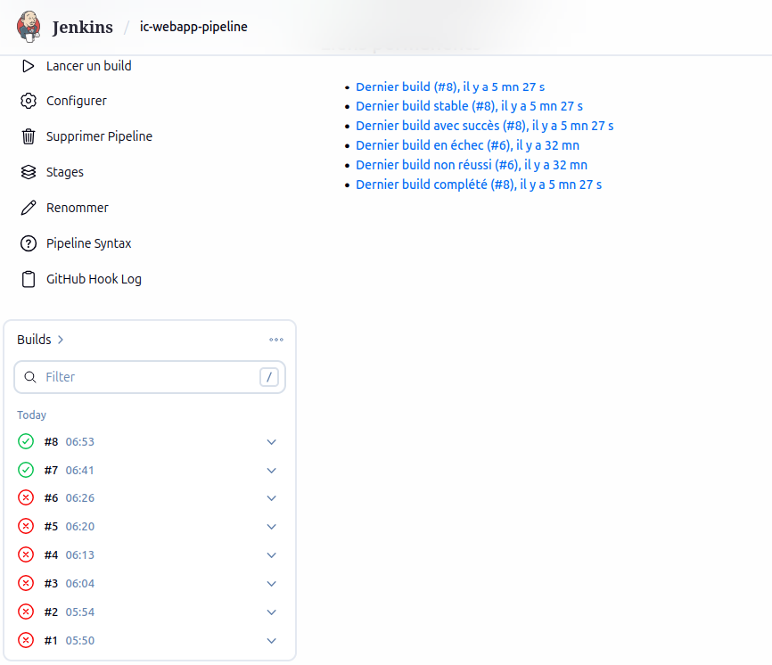

### Tests de validation du pipeline

| Test | Declenchement | Resultat |
|---|---|---|
| 1er build | Manuel (Build Now) | Succes — version 1.0 |
| 2e build | Automatique (push GitHub apres passage a la version 1.1) | Succes — version 1.1, log Jenkins : "Started by GitHub push by Marvin-Git-Project" |

---

## Partie 3 : Deploiement sur Kubernetes

### Architecture (identification des ressources)

D'apres le synoptique fourni dans l'enonce, les ressources A a H ont ete identifiees comme suit :

| Ressource | Type | Role |
|---|---|---|
| A | Service (exposition externe) | Expose ic-webapp vers l'exterieur du cluster |
| B | Pods (ic-webapp) | Le site vitrine Flask, deux replicas |
| C | Service (ClusterIP) | Route le trafic interne vers les pods Odoo |
| D | Pods (Odoo_Web) | L'application Odoo, deux replicas |
| E | Service (ClusterIP) | Route le trafic vers la base de donnees |
| F | Pod (BDD_Odoo) | PostgreSQL, base de donnees d'Odoo |
| G | Service (ClusterIP) | Route le trafic interne vers le pod pgAdmin |
| H | Pod (Pgadmin) | Interface pgAdmin |

### Etape 1 — Demarrer le cluster Kubernetes

```bash
minikube start --driver=docker --cpus=2 --memory=3000
```

Verification :
```bash
kubectl get nodes
kubectl cluster-info
```

### Cluster Minikube operationnel
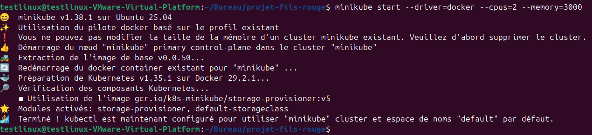

### Etape 2 — Creer le namespace dedie

k8s/namespace.yaml :
```yaml
apiVersion: v1
kind: Namespace
metadata:
  name: icgroup
  labels:
    env: prod
```

```bash
mkdir -p ~/projet-fils-rouge/k8s
cd ~/projet-fils-rouge/k8s
kubectl apply -f namespace.yaml
kubectl get namespace icgroup --show-labels
```

### Namespace icgroup cree avec le label env=prod
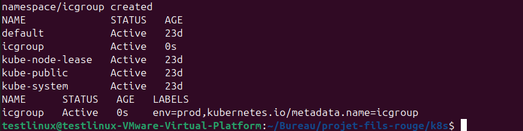

### Etape 3 — Creer les Secrets

Les informations sensibles (mots de passe) sont stockees dans des Secrets Kubernetes plutot qu'en clair dans les manifests, ceux-ci etant destines a etre publics sur GitHub.

k8s/odoo-secret.yaml :
```yaml
apiVersion: v1
kind: Secret
metadata:
  name: odoo-db-secret
  namespace: icgroup
  labels:
    env: prod
type: Opaque
stringData:
  POSTGRES_USER: odoo
  POSTGRES_PASSWORD: odoo
  POSTGRES_DB: postgres
```

k8s/pgadmin-secret.yaml :
```yaml
apiVersion: v1
kind: Secret
metadata:
  name: pgadmin-secret
  namespace: icgroup
  labels:
    env: prod
type: Opaque
stringData:
  PGADMIN_DEFAULT_EMAIL: admin@icgroup.com
  PGADMIN_DEFAULT_PASSWORD: admin
```

```bash
kubectl apply -f odoo-secret.yaml
kubectl apply -f pgadmin-secret.yaml
kubectl get secrets -n icgroup
```

### Etape 4 — Creer les volumes persistants

k8s/odoo-pv.yaml :
```yaml
apiVersion: v1
kind: PersistentVolume
metadata:
  name: odoo-db-pv
  labels:
    env: prod
spec:
  storageClassName: ""
  capacity:
    storage: 1Gi
  accessModes:
    - ReadWriteOnce
  hostPath:
    path: /data/odoo-db
```

k8s/odoo-pvc.yaml :
```yaml
apiVersion: v1
kind: PersistentVolumeClaim
metadata:
  name: odoo-db-pvc
  namespace: icgroup
  labels:
    env: prod
spec:
  storageClassName: ""
  accessModes:
    - ReadWriteOnce
  resources:
    requests:
      storage: 1Gi
```

k8s/pgadmin-pv.yaml :
```yaml
apiVersion: v1
kind: PersistentVolume
metadata:
  name: pgadmin-pv
  labels:
    env: prod
spec:
  storageClassName: ""
  capacity:
    storage: 500Mi
  accessModes:
    - ReadWriteOnce
  hostPath:
    path: /data/pgadmin
```

k8s/pgadmin-pvc.yaml :
```yaml
apiVersion: v1
kind: PersistentVolumeClaim
metadata:
  name: pgadmin-pvc
  namespace: icgroup
  labels:
    env: prod
spec:
  storageClassName: ""
  accessModes:
    - ReadWriteOnce
  resources:
    requests:
      storage: 500Mi
```

```bash
kubectl apply -f odoo-pv.yaml
kubectl apply -f odoo-pvc.yaml
kubectl apply -f pgadmin-pv.yaml
kubectl apply -f pgadmin-pvc.yaml

kubectl get pv
kubectl get pvc -n icgroup
```

storageClassName: "" est indispensable sur le PV et le PVC pour desactiver le provisionnement automatique de Minikube et forcer la liaison vers le volume cree manuellement (voir section Difficultes rencontrees).

### PVC lies aux PV crees manuellement
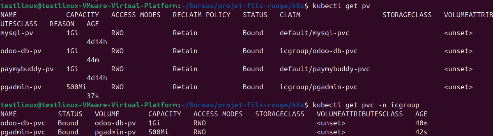

### Etape 5 — Deployer PostgreSQL (base de donnees Odoo)

k8s/odoo-db-deployment.yaml :
```yaml
apiVersion: apps/v1
kind: Deployment
metadata:
  name: odoo-db
  namespace: icgroup
  labels:
    app: odoo-db
    env: prod
spec:
  replicas: 1
  selector:
    matchLabels:
      app: odoo-db
  template:
    metadata:
      labels:
        app: odoo-db
        env: prod
    spec:
      containers:
        - name: odoo-db
          image: postgres:13
          ports:
            - containerPort: 5432
          envFrom:
            - secretRef:
                name: odoo-db-secret
          volumeMounts:
            - name: odoo-db-storage
              mountPath: /var/lib/postgresql/data
      volumes:
        - name: odoo-db-storage
          persistentVolumeClaim:
            claimName: odoo-db-pvc
```

k8s/odoo-db-service.yaml :
```yaml
apiVersion: v1
kind: Service
metadata:
  name: odoo-db-service
  namespace: icgroup
  labels:
    env: prod
spec:
  selector:
    app: odoo-db
  ports:
    - port: 5432
      targetPort: 5432
  type: ClusterIP
```

```bash
kubectl apply -f odoo-db-deployment.yaml
kubectl apply -f odoo-db-service.yaml
```

### Etape 6 — Deployer Odoo

k8s/odoo-app-deployment.yaml :
```yaml
apiVersion: apps/v1
kind: Deployment
metadata:
  name: odoo-app
  namespace: icgroup
  labels:
    app: odoo-app
    env: prod
spec:
  replicas: 2
  selector:
    matchLabels:
      app: odoo-app
  template:
    metadata:
      labels:
        app: odoo-app
        env: prod
    spec:
      containers:
        - name: odoo-app
          image: odoo:13.0
          ports:
            - containerPort: 8069
          env:
            - name: HOST
              value: odoo-db-service
            - name: USER
              valueFrom:
                secretKeyRef:
                  name: odoo-db-secret
                  key: POSTGRES_USER
            - name: PASSWORD
              valueFrom:
                secretKeyRef:
                  name: odoo-db-secret
                  key: POSTGRES_PASSWORD
```

k8s/odoo-app-service.yaml :
```yaml
apiVersion: v1
kind: Service
metadata:
  name: odoo-app-service
  namespace: icgroup
  labels:
    env: prod
spec:
  selector:
    app: odoo-app
  ports:
    - port: 8069
      targetPort: 8069
  type: ClusterIP
```

```bash
kubectl apply -f odoo-app-deployment.yaml
kubectl apply -f odoo-app-service.yaml
kubectl get pods -n icgroup
```

replicas: 2 conformement au schema fourni dans l'enonce. Odoo retrouve PostgreSQL via le nom du Service (odoo-db-service), grace a la resolution DNS interne du cluster.

Verification :
```bash
kubectl port-forward -n icgroup svc/odoo-app-service 8069:8069
# navigateur : http://localhost:8069
```

### Pods Odoo et PostgreSQL operationnels
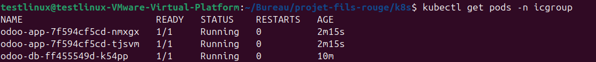

### Ecran de creation de base de donnees Odoo affiche correctement
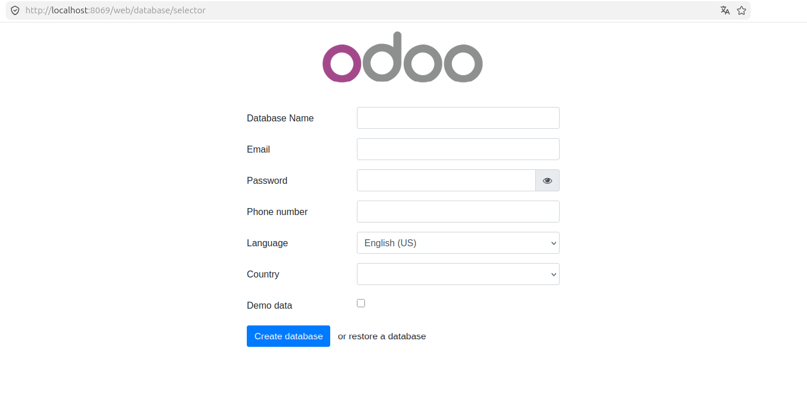

### Etape 7 — Deployer pgAdmin

k8s/pgadmin-servers-configmap.yaml — pre-configure la connexion vers la base Odoo (sur Kubernetes, le nom du Service remplace l'IP utilisee dans la Partie 2 sur AWS, tous les pods partageant le meme reseau interne) :
```yaml
apiVersion: v1
kind: ConfigMap
metadata:
  name: pgadmin-servers-config
  namespace: icgroup
  labels:
    env: prod
data:
  servers.json: |
    {
      "Servers": {
        "1": {
          "Name": "Odoo Database",
          "Group": "Servers",
          "Host": "odoo-db-service",
          "Port": 5432,
          "MaintenanceDB": "postgres",
          "Username": "odoo",
          "SSLMode": "prefer"
        }
      }
    }
```

k8s/pgadmin-deployment.yaml :
```yaml
apiVersion: apps/v1
kind: Deployment
metadata:
  name: pgadmin
  namespace: icgroup
  labels:
    app: pgadmin
    env: prod
spec:
  replicas: 1
  selector:
    matchLabels:
      app: pgadmin
  template:
    metadata:
      labels:
        app: pgadmin
        env: prod
    spec:
      containers:
        - name: pgadmin
          image: dpage/pgadmin4:latest
          ports:
            - containerPort: 80
          envFrom:
            - secretRef:
                name: pgadmin-secret
          volumeMounts:
            - name: pgadmin-storage
              mountPath: /var/lib/pgadmin
            - name: pgadmin-servers
              mountPath: /pgadmin4/servers.json
              subPath: servers.json
      volumes:
        - name: pgadmin-storage
          persistentVolumeClaim:
            claimName: pgadmin-pvc
        - name: pgadmin-servers
          configMap:
            name: pgadmin-servers-config
```

subPath: servers.json permet de monter uniquement ce fichier precis, sans remplacer tout le contenu du dossier /pgadmin4/.

k8s/pgadmin-service.yaml :
```yaml
apiVersion: v1
kind: Service
metadata:
  name: pgadmin-service
  namespace: icgroup
  labels:
    env: prod
spec:
  selector:
    app: pgadmin
  ports:
    - port: 80
      targetPort: 80
  type: ClusterIP
```

```bash
kubectl apply -f pgadmin-servers-configmap.yaml
kubectl apply -f pgadmin-deployment.yaml
kubectl apply -f pgadmin-service.yaml
kubectl get pods -n icgroup
```

Si le pod redemarre apres une correction de permissions (voir section difficultes), un import manuel du fichier de configuration est necessaire :
```bash
kubectl exec -n icgroup deployment/pgadmin -- /venv/bin/python3 /pgadmin4/setup.py load-servers /pgadmin4/servers.json --user admin@icgroup.com --replace
```

Verification :
```bash
kubectl port-forward -n icgroup svc/pgadmin-service 5050:80
# navigateur : http://localhost:5050
# login : admin@icgroup.com / admin
```

### Pod pgAdmin operationnel
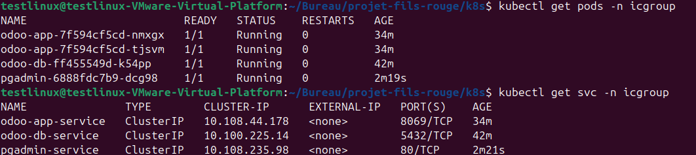

### Connexion pgAdmin a la base Odoo reussie sur Kubernetes
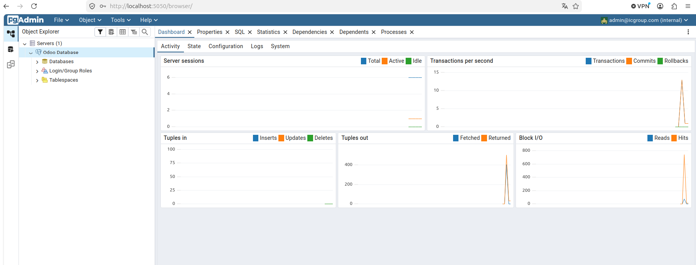

### Etape 8 — Deployer le site vitrine ic-webapp

k8s/icwebapp-deployment.yaml :
```yaml
apiVersion: apps/v1
kind: Deployment
metadata:
  name: ic-webapp
  namespace: icgroup
  labels:
    app: ic-webapp
    env: prod
spec:
  replicas: 2
  selector:
    matchLabels:
      app: ic-webapp
  template:
    metadata:
      labels:
        app: ic-webapp
        env: prod
    spec:
      containers:
        - name: ic-webapp
          image: marvindocker28/ic-webapp:1.1
          ports:
            - containerPort: 8080
```

k8s/icwebapp-service.yaml — Service de type NodePort, correspondant a la ressource A du schema, pour l'exposition vers l'exterieur du cluster :
```yaml
apiVersion: v1
kind: Service
metadata:
  name: ic-webapp-service
  namespace: icgroup
  labels:
    env: prod
spec:
  selector:
    app: ic-webapp
  ports:
    - port: 8080
      targetPort: 8080
      nodePort: 30090
  type: NodePort
```

```bash
kubectl apply -f icwebapp-deployment.yaml
kubectl apply -f icwebapp-service.yaml
```

L'image utilise les URLs definies dans releases.txt (sites officiels Odoo/pgAdmin), exactement comme en Partie 1 et Partie 2, ce qui assure la portabilite de l'image quel que soit l'environnement de deploiement.

### Etape 9 — Acceder au site vitrine et verifier le deploiement complet

```bash
minikube service ic-webapp-service -n icgroup --url
```

### Site vitrine accessible sur Kubernetes
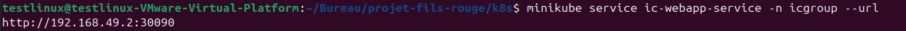

### Page du site vitrine avec les liens fonctionnels
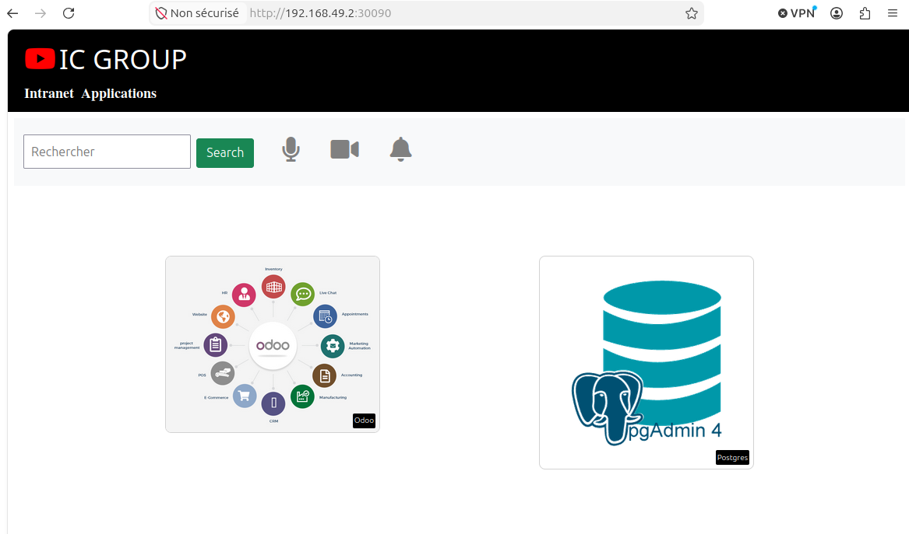

Vue complete de l'ensemble des ressources du namespace :
```bash
kubectl get all -n icgroup
kubectl get all -n icgroup --show-labels
```

### Vue complete du namespace icgroup
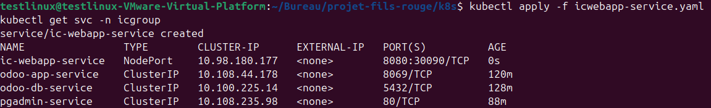

| Ressource | Type | Replicas/Etat |
|---|---|---|
| ic-webapp | Deployment | 2/2 Running |
| odoo-app | Deployment | 2/2 Running |
| odoo-db | Deployment | 1/1 Running |
| pgadmin | Deployment | 1/1 Running |
| ic-webapp-service | Service (NodePort) | 8080:30090/TCP |
| odoo-app-service | Service (ClusterIP) | 8069/TCP |
| odoo-db-service | Service (ClusterIP) | 5432/TCP |
| pgadmin-service | Service (ClusterIP) | 80/TCP |

L'ensemble des ressources du namespace icgroup porte le label env: prod, conformement a l'enonce.

### Etape 10 — Heberger les manifests sur GitHub

```bash
cd ~/projet-fils-rouge
git add k8s/
git commit -m "Ajout des manifests Kubernetes"
git push
```

---

## Difficultes rencontrees et solutions (bonus)

Cette section documente les principaux blocages rencontres au cours du projet, utile pour comprendre certains choix techniques et eviter de les reproduire.

### Port 8080 deja utilise sur le poste de pilotage

Probleme : un projet anterieur occupait deja le port 8080 lors des tests locaux de la Partie 1.
Solution : mapper le container de test sur un autre port hote (-p 8090:8080), sans toucher au port d'ecoute interne de Flask.

### Client Docker manquant dans le container Jenkins

Probleme : " docker: not found " lors de l'etape Build du pipeline.
Cause : Jenkins tourne dans un container Docker qui ne contient pas le client CLI docker, meme si le socket de l'hote est monte.
Solution : installation manuelle du paquet docker.io a l'interieur du container Jenkins.

### Permission refusee sur le socket Docker

Probleme : " permission denied while trying to connect to the Docker daemon socket ".
Cause : l'utilisateur jenkins a l'interieur du container appartenait bien a un groupe nomme docker, mais avec un identifiant numerique different de celui du groupe docker sur la machine hote.
Solution : alignement de l'identifiant via groupmod -g <ID_HOTE> docker a l'interieur du container, suivi d'un redemarrage du container.

### Echec du test dans le pipeline (curl: Failed to connect to localhost)

Probleme : la commande de test du pipeline n'arrivait pas a se connecter au container demarre juste avant.
Cause : le port publie par docker run -p 8095:8080 est mappe sur le reseau de la machine hote, pas sur celui du container Jenkins lui-meme. Un **curl http://localhost:8095** execute depuis l'interieur du container Jenkins ne pouvait donc pas atteindre ce port.
Solution : interroger directement l'adresse IP interne du container teste via docker inspect, en restant sur le reseau Docker partage, plutot que de passer par le port publie sur l'hote.

### Conflit de nom de container lors d'un nouveau build

Probleme : " Conflict. The container name "/test-pipeline" is already in use. "
Cause : un build precedent ayant echoue avant l'etape de nettoyage avait laisse un container test-pipeline residuel.
Solution : ajout d'une commande de nettoyage preventif en debut d'etape Test (docker rm -f test-pipeline || true).

### Jenkins ne redemarre pas automatiquement apres un arret/redemarrage de l'instance EC2

Probleme : apres un arret puis redemarrage de l'instance EC2, Jenkins restait inaccessible.
Solution : relance manuelle via docker start jenkins, ou configuration d'une politique de redemarrage avec **docker update --restart=unless-stopped jenkins**.

### Volume persistant lie au mauvais stockage sur Kubernetes

Probleme : malgre la creation manuelle d'un PersistentVolume avec un chemin precis, le PersistentVolumeClaim se liait systematiquement a un volume genere automatiquement par Minikube.
Solution : ajouter storageClassName: "" sur le PV et sur le PVC, pour desactiver le provisionnement automatique et forcer la liaison manuelle.

### Erreur de permission sur le volume persistant de pgAdmin

Probleme : le pod pgAdmin restait signale comme Running, mais l'application plantait en boucle a l'interieur, rendant la page web inaccessible.
Erreur exacte : Permission denied: '/var/lib/pgadmin/sessions'.
Cause : le container pgAdmin tourne avec un utilisateur non-root, alors que le dossier hostPath du volume appartenait par defaut a l'utilisateur racine du noeud Minikube.
Solution : ajustement des permissions du dossier hote (minikube ssh, puis chmod -R 777), suivi de la suppression et de la recreation du pod.

### Fichier de pre-configuration servers.json monte mais jamais importe par pgAdmin

Probleme : meme apres correction des permissions, le serveur "Odoo Database" n'apparaissait jamais dans l'interface pgAdmin.
Cause : contrairement a l'environnement Docker Compose (Partie 2), l'image dpage/pgadmin4 ne relit pas systematiquement ce fichier au demarrage si sa base de configuration interne a deja ete initialisee une premiere fois.
Solution : declenchement manuel de l'import via le script fourni par l'image (setup.py load-servers), apres avoir identifie le bon interpreteur Python (celui du venv interne de l'image) et la bonne syntaxe de sous-commande.

---

## Commandes utiles

| Action | Commande |
|--------|----------|
| Voir les conteneurs Docker actifs | docker ps |
| Logs d'un container | docker logs <nom> |
| Se connecter en SSH a un serveur | ssh -i projet-fil-rouge-key.pem ubuntu@<ip> |
| Lancer le pipeline Ansible | ansible-playbook -i hosts deploy.yml |
| Tester la connectivite Ansible | ansible all -i hosts -m ping |
| Voir tous les pods Kubernetes | kubectl get pods -n icgroup |
| Vue complete du namespace | kubectl get all -n icgroup |
| Logs d'un pod | kubectl logs -n icgroup <nom-du-pod> |
| Executer une commande dans un pod | kubectl exec -n icgroup <pod> -- <commande> |
| Exposer temporairement un Service | kubectl port-forward -n icgroup svc/<service> <port-local>:<port-distant> |
| Recuperer l'URL d'un Service NodePort | minikube service <service> -n icgroup --url |
| Se connecter au noeud Minikube | minikube ssh |

---

## Auteur

Projet realise par **Marvin-Git-Project**
Dans le cadre d'un bootcamp proposé par **Eazytraining**
